## Context and Problem Statement

We currently maintain two parallel validation paths for documentation quality:

- A unified pipeline in Node based on remark-parse + remark-lint with a few custom plugins.
- Bespoke Ajv-driven scripts for frontmatter and folder structure checks executed outside unified.

This duplication increases maintenance, reduces signal consistency, and complicates CI. We need a single, extensible linting architecture that centralizes schema, structure, and cross-file validations with consistent messaging and configuration.

## Decision

Adopt a layered, unified pipeline built on unified/remark-lint as the single source of truth for documentation linting and validation. All schema, structure, Diátaxis placement, cross-references, and backlog semantics will be implemented as remark plugins with a shared configuration and caching layer.

### Scope

- Central config via a `.remarkrc.mts` and a programmatic `createTiabProcessor()` factory.
- Ajv-backed frontmatter schema validation integrated as a remark plugin with shared cache.
- Diátaxis/template compliance, cross-file graph checks (links, naming, dependency cycles), and backlog semantics as dedicated remark plugins.
- Consistent message format and severity control across all rules.

## Decision Drivers

- Single place to add/maintain rules (reduce drift and cost).
- Deterministic output for developers and CI (improved UX).
- Extensibility for future rules (auto-fix suggestions, policies) without new CLIs.
- Performance headroom via shared caches and pre-scan project context.

## Considered Options

1. Continue with dual-path validation (scripts + remark-lint)
2. Fully adopt unified/remark-lint and port all validations to plugins (chosen)
3. Replace with a different doc engine (e.g., MDX/ESLint only)

### Option 1: Keep dual paths

- Pros: Minimal change; keeps existing behavior.
- Cons: Drift between tools; duplicate code; poor developer experience.

### Option 2: remark-lint everywhere (chosen)

- Pros: Single config and toolchain; strong plugin ecosystem; easier CI; consistent messages.
- Cons: Initial migration effort; requires plugin authoring discipline.

### Option 3: Different engine

- Pros: Potentially powerful static analysis via alternate ecosystems.
- Cons: Large migration risk; reduced alignment with current investments.

## Consequences

Positive:

- One command and format for developers; predictable failures.
- Rules become reusable modules with docs and tests.
- Cross-repo portability for future consumers.

Negative/Risks:

- Short-term migration complexity; potential noise from new rules.
- Performance regressions from cross-file checks if not cached.

## Validation and Rollout

- Snapshot current outputs; ensure parity or intentional deltas.
- Benchmarks before/after with ≥ 200 files.
- Staged rollout with a “perf mode” and a legacy fallback script for one release cycle.

## Architecture Sketch

```mermaid
flowchart TD
  A[remark-parse] --> B[remark-frontmatter]
  B --> C[Layer 1: Frontmatter Schema (Ajv cache)]
  C --> D[Layer 2: Template & Diátaxis Rules]
  D --> E[Layer 3: Project Context Registry]
  E --> F[Crossref, Naming, Backlog, Lifecycle]
  F --> G[Layer 4: Policies & Suggestions]
```

## Migration Plan (Summary)

1. Establish central config and normalize existing plugins (tests + zod options).
2. Port Ajv validation inside remark; add schema caching.
3. Add Diátaxis/classifier and template mapping rules.
4. Build registry for cross-file checks; port crossref/naming/backlog.
5. Add optional policies and suggestion rules; wire CI; deprecate legacy scripts.

```mermaid
graph TD
  E170[Epic: Unified remark-lint adoption] --> F171[Feature: Centralized config]
  E170 --> F172[Feature: Frontmatter schema]
  E170 --> F173[Feature: Diataxis/template]
  E170 --> F174[Feature: Graph/naming]
  E170 --> F175[Feature: Policies/suggestions]
  E170 --> F176[Feature: CI/deprecation]

  F171 --> S1711[Story: Centralized config]
  S1711 --> T17111[Task: .remarkrc.mts & factory]
  S1711 --> T17112[Task: Plugin normalization/tests]

  F172 --> S1721[Story: Frontmatter validation]
  S1721 --> T17211[Task: Ajv plugin]
  S1721 --> T17212[Task: CLI migration/parity]

  F173 --> S1731[Story: Diataxis/template]
  S1731 --> T17311[Task: Classifier plugin]
  S1731 --> T17312[Task: Template compliance extension]

  F174 --> S1741[Story: Graph/naming]
  S1741 --> T17411[Task: Registry utility]
  S1741 --> T17412[Task: Crossref plugin]
  S1741 --> T17413[Task: Naming rules]
  S1741 --> T17414[Task: Backlog/lifecycle rules]

  F175 --> S1751[Story: Policies/suggestions]
  S1751 --> T17511[Task: Link policy plugin]
  S1751 --> T17512[Task: Dependency graph]
  S1751 --> T17513[Task: Autofix suggestions]

  F176 --> S1761[Story: CI/deprecation]
  S1761 --> T17611[Task: Npm scripts/docs]
  S1761 --> T17612[Task: Legacy fallback/removal]
```



## Links

- Target Architecture: [[../../reference/remark-lint-unified-architecture.md]]
