# Backlog Progress Dashboard

| ID | Title | Type | Status | Assignee | File |
|----|-------|------|--------|----------|------|
| 4 | Enhanced Schema Validation Errors | work-item/template | ❔ proposed |  | process-improvement/4.enhanced-schema-validation-errors.md |
| 27 | Decision Doc Context Enforcement | work-item/template | ❔ proposed |  | meta-prompt/27.decision-doc-context-enforcement.md |
| 30 | Markdown Linting Commercialization | work-item/template | ❔ proposed |  | question/30.markdown-linting-commercialization.md |
| 31 | Folder Reorganization | work-item/template | ❔ proposed |  | process-improvement/31.folder-reorganization.md |
| 33 | Documentation Organization Strategy | work-item/template | ❔ complete |  | process-improvement/33.documentation-organization-strategy.md |
| 34 | Operations & Security Folder Decision | work-item/template | ❔ proposed |  | process-improvement/34.operations-security-folder-decision.md |
| 36 | Compliance Field Format Finalization | work-item/template | ❔ proposed |  | process-improvement/36.compliance-field-format-finalization.md |
| 37 | Implement Frontmatter JSON Schemas | work-item/task | ❔ complete |  | validation/37.frontmatter-json-schemas.md |
| 38 | Implement Remark-Lint Content Rules | work-item/template | ❔ proposed |  | process-improvement/38.remark-lint-content-rules.md |
| 43 | Testing Strategy Physical Relocation | work-item/template | ❔ proposed |  | process-improvement/43.testing-strategy-physical-relocation.md |
| 44 | Stories Reorganization by Epic | work-item/template | ❔ proposed |  | process-improvement/44.stories-reorganization-by-epic.md |
| 50 | Extended Asset Type Validation | work-item/template | ❔ proposed |  | process-improvement/50.extended-asset-type-validation.md |
| 52 | Finalize Metadata Enums & Schema Validation Rules | work-item/template | ❔ proposed |  | process-improvement/52.finalize-metadata-enums-schema-validation-rules.md |
| 156.lint-frontmatter-bug | Linting Does Not Fail on Frontmatter Schema Errors | work-item/bug | ❔ open |  | bug/156.lint-frontmatter-bug.md |
| 160 | Documentation Template Compliance | work-item/feature | ❔ proposed | @me | feature/160.template-compliance-feature.md |
| 170 | Adopt Unified remark-lint Pipeline Across Doc-Vader | work-item/epic | ❔ proposed | @change-manager | epic/170.remark-lint-unified-adoption-epic.md |
| 171 |   Centralized remark configuration and core pipeline | work-item/feature | ❔ proposed | @change-manager | feature/171.unified-config-and-core-pipeline-feature.md |
| 171.1 |     Establish centralized remark configuration and core pipeline | work-item/story | 📝 draft | @change-manager | story/171.1.centralized-remark-config-story.md |
| 171.1.1 |       Create .remarkrc.mjs and processor factory | work-item/task | 📝 draft | @change-manager | task/171.1.1.remark-config-and-factory-task.md |
| 172 |   Integrate Ajv frontmatter validation into remark | work-item/feature | ❔ proposed | @change-manager | feature/172.frontmatter-schema-integration-feature.md |
| 172.1 |     Unify frontmatter validation into the remark pipeline | work-item/story | 📝 draft | @change-manager | story/172.1.unify-frontmatter-validation-story.md |
| 172.1.1 |       Implement Ajv-backed remark-frontmatter-schema plugin | work-item/task | 📝 draft | @change-manager | task/172.1.1.implement-frontmatter-schema-plugin-task.md |
| 173 |   Diátaxis placement and template compliance in remark | work-item/feature | ❔ proposed | @change-manager | feature/173.diataxis-and-template-integration-feature.md |
| 173.1 |     Enforce Diátaxis placement and template compliance in remark | work-item/story | 📝 draft | @change-manager | story/173.1.diataxis-template-story.md |
| 173.1.1 |       Implement diataxis-classifier plugin | work-item/task | 📝 draft | @change-manager | task/173.1.1.diataxis-classifier-plugin-task.md |
| 174 |   Cross-file registry, crossref, naming, backlog semantics | work-item/feature | ❔ proposed | @change-manager | feature/174.cross-file-graph-and-naming-feature.md |
| 174.1 |     Implement project registry and graph-based rules (crossref, naming, backlog) | work-item/story | 📝 draft | @change-manager | story/174.1.graph-and-naming-story.md |
| 174.1 |     Implement project registry, crossref, naming, backlog/lifecycle rules | work-item/story | 📝 draft | @change-manager | task/174.1.graph-and-naming-story.md |
| 175 |   Policies, dependency cycles, and auto-fix suggestions | work-item/feature | ❔ proposed | @change-manager | feature/175.extended-rules-and-autofix-feature.md |
| 175.1 |     Implement policies, dependency cycles, and auto-fix suggestions | work-item/story | 📝 draft | @change-manager | story/175.1.policies-and-suggestions-story.md |
| 175.1.1 |       Implement link policy plugin | work-item/task | 📝 draft | @change-manager | task/175.1.1.link-policy-plugin-task.md |
| 176 |   CI integration, perf mode, and legacy deprecation | work-item/feature | ❔ proposed | @change-manager | feature/176.ci-integration-and-deprecation-feature.md |
| 176.1 |     Integrate unified pipeline into CI and deprecate legacy scripts | work-item/story | 📝 draft | @change-manager | story/176.1.ci-and-deprecation-story.md |
| 176.1.1 |       Update npm scripts and document perf/full modes | work-item/task | 📝 draft | @change-manager | task/176.1.1.npm-scripts-and-docs-task.md |
| doc-vader-project-brief | Doc-Vader Project Brief | project-brief/ | 📝 draft |  | project-brief.md |
| 205.improve-frontmatter-validation-task | Improve Markdown Frontmatter Validation | work-item/task | 📝 draft |  | task/205.improve-frontmatter-validation-task.md |
| 206.fix-linting-reporting-bug-task | Fix Linting/Reporting Bug for Frontmatter Schema Errors | work-item/task | 📝 draft |  | task/206.fix-linting-reporting-bug-task.md |
| framework-reconciliation | Framework Reconciliation Workflow | work-item/feature | ❔ proposed |  | task/framework-reconciliation.md |
| support-multi-frameworks | Support Multiple Documentation Frameworks | work-item/feature | ❔ proposed |  | task/support-multi-frameworks.md |
| wi-003 | Extend Diataxis Fixer to Auto-Generate Missing Frontmatter | work-item/tooling | ❔ proposed |  | task-frontmatter-fixer.md |
| wi-002 | Parser Precedence and Fenced Code Block Exclusion | work-item/feature | ❔ proposed |  | task-precedence-tests.md |

## Mermaid Hierarchy

```mermaid
flowchart TB
  4["Enhanced Schema Validation Errors"] 
  27["Decision Doc Context Enforcement"] 
  30["Markdown Linting Commercialization"] 
  31["Folder Reorganization"] 
  33["Documentation Organization Strategy"] 
  34["Operations & Security Folder Decision"] 
  36["Compliance Field Format Finalization"] 
  37["Implement Frontmatter JSON Schemas"] 
  38["Implement Remark-Lint Content Rules"] 
  43["Testing Strategy Physical Relocation"] 
  44["Stories Reorganization by Epic"] 
  50["Extended Asset Type Validation"] 
  52["Finalize Metadata Enums & Schema Validation Rules"] 
  156.lint-frontmatter-bug["Linting Does Not Fail on Frontmatter Schema Errors"] 
  170["Adopt Unified remark-lint Pipeline Across Doc-Vader"] --> 171["Centralized remark configuration and core pipeline"]
  171["Centralized remark configuration and core pipeline"] --> 171.1["Establish centralized remark configuration and core pipeline"]
  171.1["Establish centralized remark configuration and core pipeline"] --> 171.1.1["Create .remarkrc.mjs and processor factory"]
  170["Adopt Unified remark-lint Pipeline Across Doc-Vader"] --> 172["Integrate Ajv frontmatter validation into remark"]
  172["Integrate Ajv frontmatter validation into remark"] --> 172.1["Unify frontmatter validation into the remark pipeline"]
  172.1["Unify frontmatter validation into the remark pipeline"] --> 172.1.1["Implement Ajv-backed remark-frontmatter-schema plugin"]
  170["Adopt Unified remark-lint Pipeline Across Doc-Vader"] --> 173["Diátaxis placement and template compliance in remark"]
  173["Diátaxis placement and template compliance in remark"] --> 173.1["Enforce Diátaxis placement and template compliance in remark"]
  173.1["Enforce Diátaxis placement and template compliance in remark"] --> 173.1.1["Implement diataxis-classifier plugin"]
  170["Adopt Unified remark-lint Pipeline Across Doc-Vader"] --> 174["Cross-file registry, crossref, naming, backlog semantics"]
  174["Cross-file registry, crossref, naming, backlog semantics"] --> 174.1["Implement project registry and graph-based rules (crossref, naming, backlog)"]
  174["Cross-file registry, crossref, naming, backlog semantics"] --> 174.1["Implement project registry, crossref, naming, backlog/lifecycle rules"]
  170["Adopt Unified remark-lint Pipeline Across Doc-Vader"] --> 175["Policies, dependency cycles, and auto-fix suggestions"]
  175["Policies, dependency cycles, and auto-fix suggestions"] --> 175.1["Implement policies, dependency cycles, and auto-fix suggestions"]
  175.1["Implement policies, dependency cycles, and auto-fix suggestions"] --> 175.1.1["Implement link policy plugin"]
  170["Adopt Unified remark-lint Pipeline Across Doc-Vader"] --> 176["CI integration, perf mode, and legacy deprecation"]
  176["CI integration, perf mode, and legacy deprecation"] --> 176.1["Integrate unified pipeline into CI and deprecate legacy scripts"]
  176.1["Integrate unified pipeline into CI and deprecate legacy scripts"] --> 176.1.1["Update npm scripts and document perf/full modes"]
  doc-vader-project-brief["Doc-Vader Project Brief"] 
  205.improve-frontmatter-validation-task["Improve Markdown Frontmatter Validation"] 
  206.fix-linting-reporting-bug-task["Fix Linting/Reporting Bug for Frontmatter Schema Errors"] 
  framework-reconciliation["Framework Reconciliation Workflow"] 
  support-multi-frameworks["Support Multiple Documentation Frameworks"] 
  wi-003["Extend Diataxis Fixer to Auto-Generate Missing Frontmatter"] 
  wi-002["Parser Precedence and Fenced Code Block Exclusion"] 
  click 4 "process-improvement/4.enhanced-schema-validation-errors.md"
  click 27 "meta-prompt/27.decision-doc-context-enforcement.md"
  click 30 "question/30.markdown-linting-commercialization.md"
  click 31 "process-improvement/31.folder-reorganization.md"
  click 33 "process-improvement/33.documentation-organization-strategy.md"
  click 34 "process-improvement/34.operations-security-folder-decision.md"
  click 36 "process-improvement/36.compliance-field-format-finalization.md"
  click 37 "validation/37.frontmatter-json-schemas.md"
  click 38 "process-improvement/38.remark-lint-content-rules.md"
  click 43 "process-improvement/43.testing-strategy-physical-relocation.md"
  click 44 "process-improvement/44.stories-reorganization-by-epic.md"
  click 50 "process-improvement/50.extended-asset-type-validation.md"
  click 52 "process-improvement/52.finalize-metadata-enums-schema-validation-rules.md"
  click 156.lint-frontmatter-bug "bug/156.lint-frontmatter-bug.md"
  click 160 "feature/160.template-compliance-feature.md"
  click 170 "epic/170.remark-lint-unified-adoption-epic.md"
  click doc-vader-project-brief "project-brief.md"
  click 205.improve-frontmatter-validation-task "task/205.improve-frontmatter-validation-task.md"
  click 206.fix-linting-reporting-bug-task "task/206.fix-linting-reporting-bug-task.md"
  click framework-reconciliation "task/framework-reconciliation.md"
  click support-multi-frameworks "task/support-multi-frameworks.md"
  click wi-003 "task-frontmatter-fixer.md"
  click wi-002 "task-precedence-tests.md"
```

