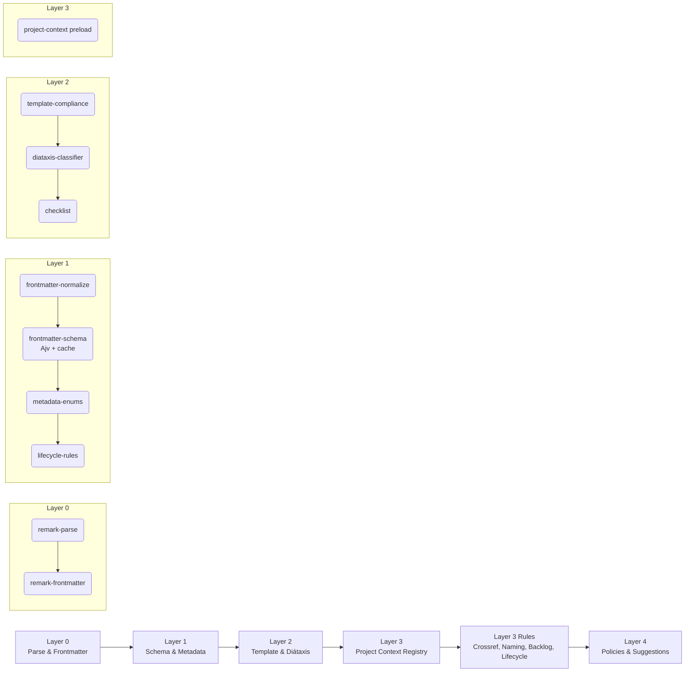
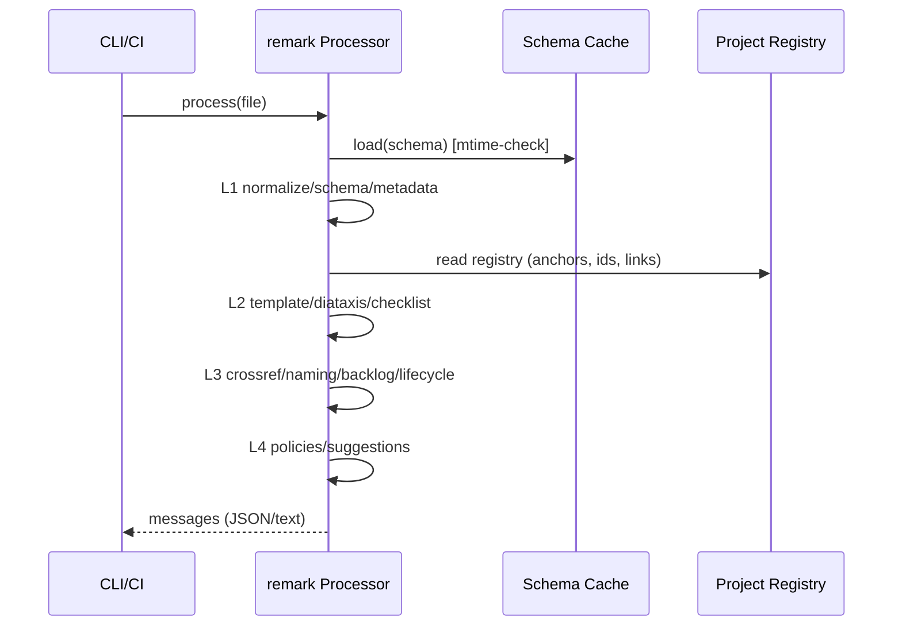

## Overview

This document defines the target architecture for consolidating all documentation linting and validation into a single unified pipeline built on unified/remark-lint. The design separates concerns into ordered layers, uses a shared project context for cross-file checks, and standardizes rule configuration and message format.

## Architecture Layers

## Plugin Inventory and Mapping

| Layer | Plugin/Rule                      | Status   | Notes                                  |
| ----- | -------------------------------- | -------- | -------------------------------------- |
| 0     | remark-parse, remark-frontmatter | existing | Parse Markdown + YAML frontmatter      |
| 1     | frontmatter-normalize            | new      | Normalize IDs/dates into vFile.data    |
| 1     | frontmatter-schema (Ajv)         | migrate  | Port Ajv script into plugin with cache |
| 1     | metadata-enums                   | new      | Validate enums per schema              |
| 1     | lifecycle-rules                  | new      | Enforce lifecycle/status transitions   |
| 2     | template-compliance              | extend   | Multi-template support by subtype      |
| 2     | diataxis-classifier              | new      | Validate folder placement vs subtype   |
| 2     | checklist                        | existing | Ensure required checklist items        |
| 3     | project-context                  | new      | Pre-scan registry: files, anchors, ids |
| 3     | crossref                         | extend   | Use registry; validate anchors & files |
| 3     | naming-conventions               | new      | Filename and slug patterns             |
| 3     | backlog-semantic                 | new      | Epic/feature/story/task links & deps   |
| 3     | lifecycle-rules (uses context)   | new      | Cross-item lifecycle integrity         |
| 4     | link-external-policy             | new      | Allow/deny list for external links     |
| 4     | dependency-graph                 | new      | Detect cycles; warn on large fan-in    |
| 4     | auto-fix-suggestions             | new      | Provide non-mutating suggestions       |

## Processor Contract

- Input: Markdown file contents with YAML frontmatter.
- Output: remark vfile messages with standardized metadata:
  - code: `tiab:<domain>:<rule>`
  - severity: error|warn|info (configurable)
  - docsUrl: link to rule docs
- Shared context: Ajv instance, schema cache, project registry.

## Configuration Strategy

- `.remarkrc.mts` defines the canonical pipeline order and rule options.
- `createTiabProcessor({ mode, overrides })` factory for programmatic use.
- `tiab-lint.config.mjs` (optional) to externalize rule tuning (e.g., required checklist items, severity mapping).
- Environment flags: `TIAB_LINT_MODE=perf|full`, `STRICT_FRONTMATTER=1|0`.

## Closure and Guardrail Layers

- Backlog closure model is enforced by schema compatibility:
  - `status: closed` supported across lifecycle transitions.
  - `status_reason` required for closed work-items.
- Guardrail lane for backlog hygiene is executed with deterministic CLI gates:
  - `doc-vader backlog validate --fail-on error|warning`
  - `doc-vader backlog validate --format json`
  - `doc-vader backlog validate --profile <name|path>`
  - `doc-vader backlog validate --schema-map <path>`
- CI should run warning-level failure policy to block merge on unresolved hygiene drift.

## Data Flow

## Success Criteria

- Single-command lint with consistent output across all rules.
- Parity with legacy scripts or intentional, documented deltas.
- Full-lint time within target bounds; perf mode for local iterations.

## References

- Decision: [[../architecture/decisions/adr-001-remark-lint-unified-adoption.md]]
- [Unified/remark](https://unifiedjs.com/) - on [GitHub](https://github.com/remarkjs/remark-lint)
